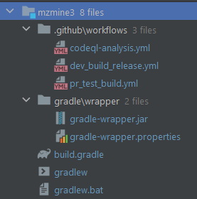
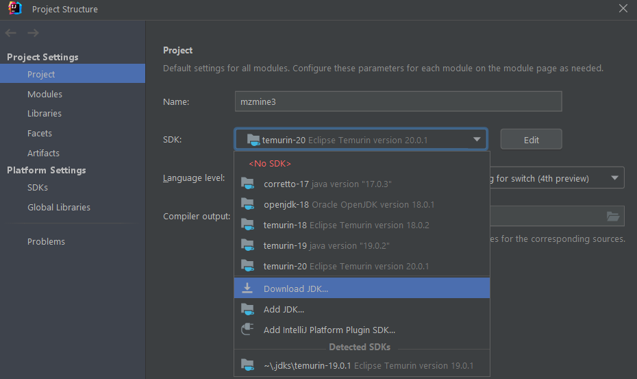
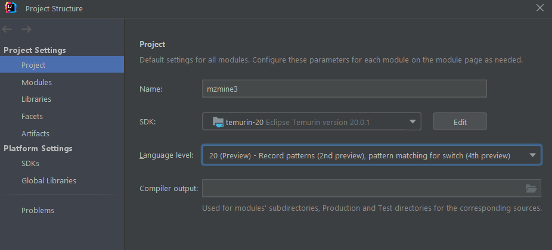
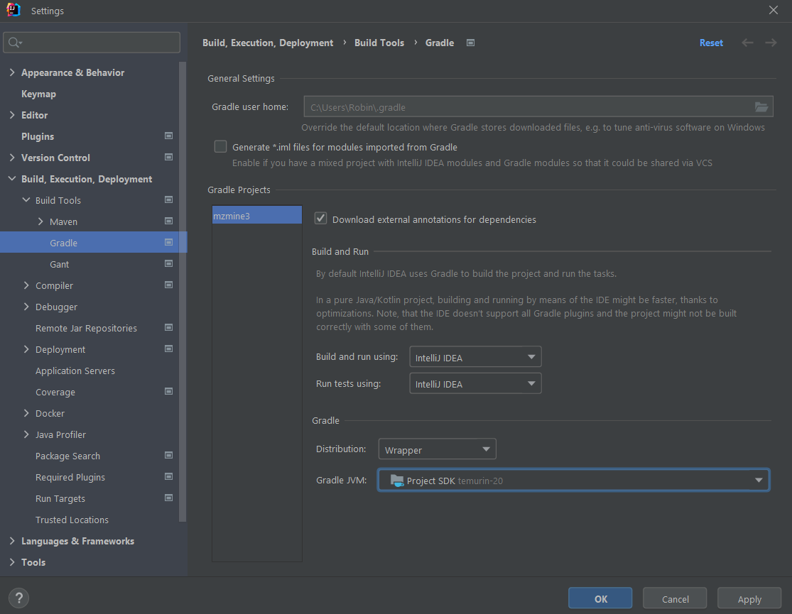

# Upgrading JDK version in development builds

## 1. Update your IDE

IntelliJ and other IDEs need to be updated to handle new JDK versions.

## 2. Update gradle version in the wrapper

Check the compatibility of gradle and JDKs. Sometimes gradle has to run on an earlier JDK but can compile with the latest JDK as target.
[](https://docs.gradle.org/current/userguide/compatibility.html)

Try upgrading the gradle wrapper:
[](https://docs.gradle.org/current/userguide/gradle_wrapper.html#sec:upgrading_wrapper)

Or change the gradle version manually in the **/gradle/wrapper/gradle-wrapper.properties** file:

```
distributionUrl=https\://services.gradle.org/distributions/gradle-8.1.1-bin.zip
```

## 3. Change target JDK in **build.gradle**

```
java {
    toolchain {
        languageVersion = JavaLanguageVersion.of(20)
        vendor = JvmVendorSpec.ADOPTIUM  // force use ADOPTIUM TEMURIN JDK
    }
    // not needed with toolchain command
//    sourceCompatibility = "20"
//    targetCompatibility = "20"
}
```

## 4. Update gradle project

Run update all gradle projects to update all dependencies.

## 5. Update JDK in GitHub actions

```
    steps:
        - uses: actions/checkout@v3
        - uses: actions/setup-java@v3
        with:
            distribution: 'temurin'
            java-version: '20.0.1'
            cache: 'gradle'
```

## PR might look like:



## IntelliJ specifics

1. Download a new JDK
2. Set the language Level (preview?)
3. Set the project jdk gradle should use and run tests on intellij (faster)






