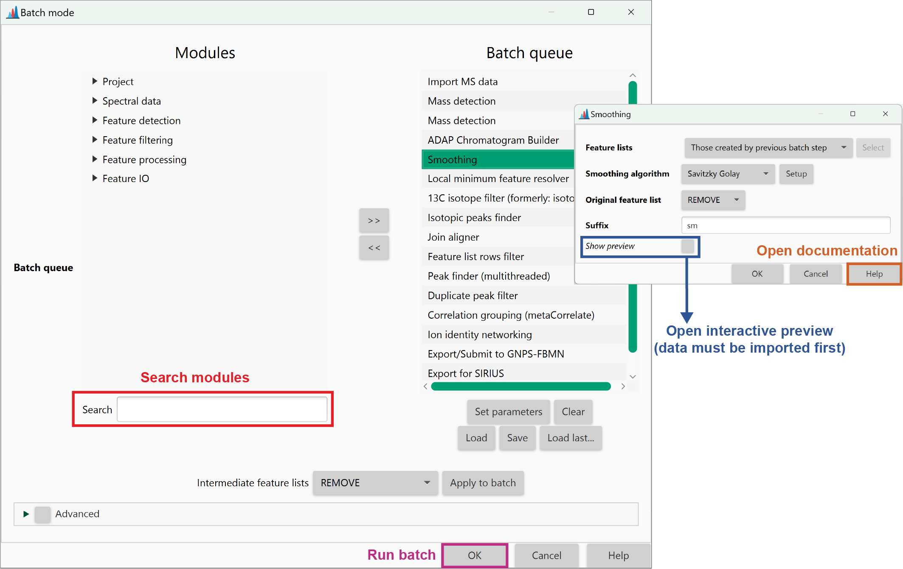
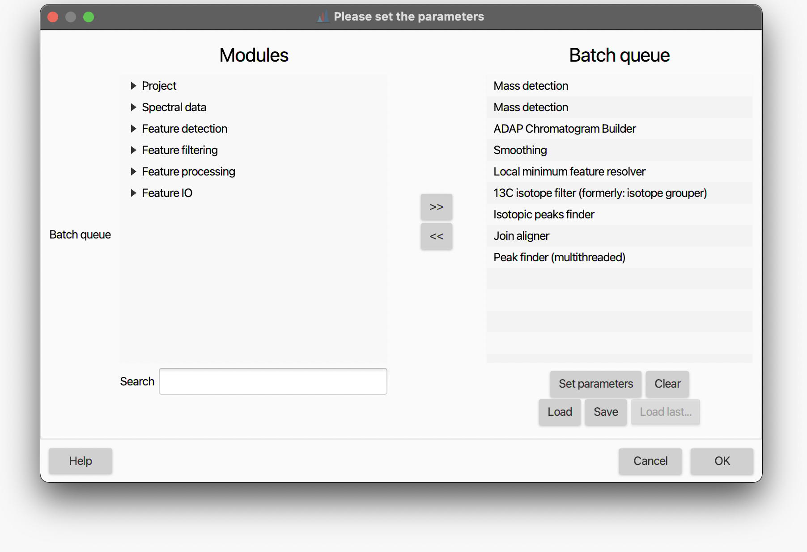
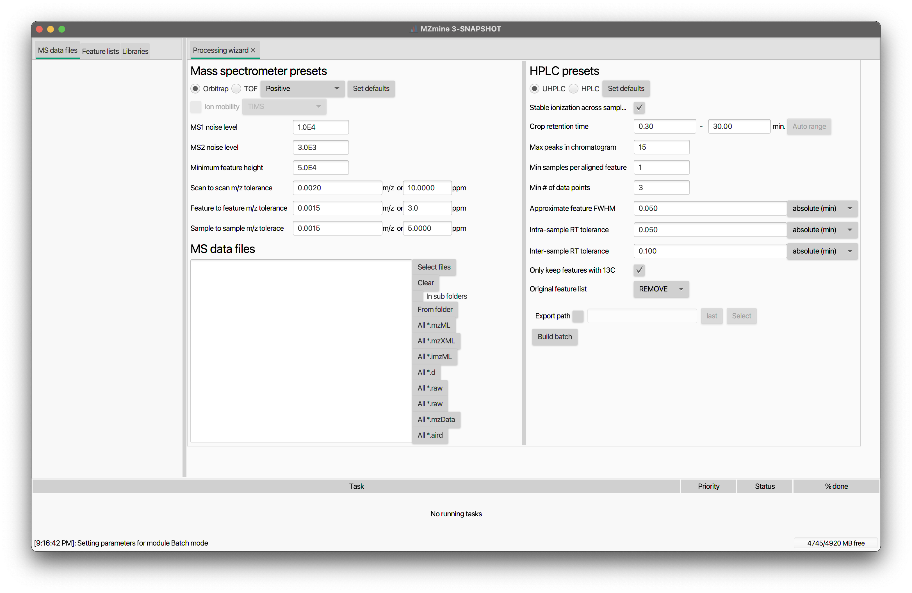

# **Batch processing**

Besides the interactive [GUI](main_window.md), MZmine can be also run in **batch mode**, which means using the so-called [batch files](#batch-file). Batch processing enables the user to run entire processing pipelines with a few clicks, or even through the [command-line interface (CLI](#command-line-interface-cli). This makes MZmine suitable to be integrated into automated data analysis pipelines (e.g. QC systems).

## Batch file

A batch file (XML format) is basically a list of processing steps (i.e., modules and their corresponding parameters) for MZmine to run one after another. Virtually any processing pipeline (including data import/export) can be saved as a batch file and executed with a few clicks [through the GUI](#batch-mode-gui). Batch files can be also opened in the GUI, which is a good way to visualise the structure of your workflow. To do so, go to '**Project → Batch mode**' or press ++ctrl+b++ (++command+b++ on Mac). This will open the following dialog:



You can load a batch file using the 'Load' button.The 'Batch queue' panel displays the current processing steps. Additional steps can be selected from the ‘Modules’ panel and included/excluded using the double-arrows buttons. You can double-click on each of the processing step to open the corresponding dialog box and review settings. Modules the offer a ‘Show preview’ option (e.g., [Mass detection](../module_docs/featdet_mass_detection/mass-calibration.md)) need the raw data to be already imported in MZmine for the preview to work. Use the 'Save' button to save your batch file.

!!! tip

    Batch files offer a convenient way to share a precise description of the data processing steps with your collaborators or within a publication.

---

## Batch mode (GUI)

**Project :material-arrow-right-thin: Batch mode**


When a new step is added to the queue its parameter setup dialog is shown. The "Set paramaters" button allows the user to modify a step's parameter settings. The "Clear" button removes all steps. The "Load" and "Save" buttons make it possible to read and write batch steps to XML files.

The first step of a batch queue is performed on those raw data files and/or peak lists selected by the user. The remaining steps are performed on the results produced by each preceding step (File/Feature list selection must be set to _Those created by previous batch step_). For example, if the first step of the batch queue is the [ADAP chromatogram builder](../module_docs/lc-ms_featdet/featdet_adap_chromatogram_builder/adap-chromatogram-builder.md), it will produce peak lists as a result. If the following step were Peak list deconvolution then it will be performed on the peak lists produced by the preceding Chromatogram builder step.

:octicons-alert-16: **Tip** MZmine "remembers" the last settings used.

# Processing wizard

The processing wizard is inteded to quickly set up a general workflow for the processing of untargeted LC-MS and LC-IM-MS data. By clicking the "Set default" button, default settings for mass and feature detection are also provided according to the selected MS type (Orbitrap or TOF) and LC system (UHPLC or HPLC). Once the desired parameters have been set, hit the "Build batch" botton and a pre-populated batch window will open up.

**Tools :material-arrow-right-thin: Processing wizard**


### **Mass spectrometers presets**

MS type: When TOF is selected, the "Ion mobility" can be enabled <br>
MS1 and MS2 noise level: <br>
Minimum feature height: <br>
Scan to scan m/z tolerance: <br>
Feature to feature m/z tolerance: <br>

### **HPLC presets**

Stable ionization across samples: <br>
Crop retention time: <br>
Max peaks in chromatogram: <br>
Min samples per aligned feature: <br>
Min # of data points: <br>
Approximate feature FWHM: <br>
Intra-sample RT tolerance: <br>
Inter-sample RT tolerance: <br>
Only keep feature with 13C: <br>
Original feature list: <br>
Export path: <br>

!!! warning

    The default settings were optimized on sample datasets used during the MZmine 3 development. Although probably suitable for many appications, it is strongly recommended not to blindly rely on them. Rather, optimal processing parameters should be chosen based on the LC-(IM)-MS system performance and data acquisition settings.

# Batch mode (CLI)

The CLI can be used to run MZmine in headless batch mode, which allows its integration into automated data analysis pipelines (e.g. QC systems). Running MZmine through the terminal also avoids computer memory usage by the GUI (see [here](../troubleshooting/performance.md))

## On Windows

An easy way to start MZmine with arguments is to create a shortcut to the MZmine.exe, right-click, and define the target with additional arguments. This example runs MZMine in batch mode (headless), imports the specified batch file, overrides the memory management to **none** (which is the default), effectively using memory mapping to store and access spectral, centroid, and feature data from temporary files stored in the defined temp directory. By leaving out the _memory_ or _temp_ arguments, the values stored in the current _preferences_ file will be used, or the default values if no _preferences_ file was found.

**Process all .mzML files in a folder by the provided batch file**

```
"C:\Program Files\MZmine\MZmine.exe" -batch "D:\batch\my_batch_file.xml" -input "D:\Data\*.mzML"
```

**Defining the temp folder, otherwise uses the one specified in local configuration**

```
"C:\Program Files\MZmine\MZmine.exe" -batch "D:\batch\my_batch_file.xml" -temp "D:\tmpmzmine"
```

**Start MZmine batch with memory mapping (DEFAULT)**

```
"C:\Program Files\MZmine\MZmine.exe" -batch "D:\batch\my_batch_file.xml" -memory none -temp "D:\tmpmzmine"
```

**Start MZmine batch on machines with enough memory (RAM) with -memory all** this will disable memory mapping to temporary files.

```
"C:\Program Files\MZmine\MZmine.exe" -batch "D:\batch\my_batch_file.xml" -memory all -temp "D:\tmpmzmine"
```

## On macOS

If the app was installed to the _Applications_ folder, you can run MZmine by opening your terminal and typing the following command (this will open the GUI):

```
/Applications/MZmine.app/Contents/MacOS/MZmine
```

In order to run MZmine in headless mode, you need to provide at least one batch file as argument. Other possible argumnents are listed [below](#arguments):

```
/Applications/MZmine.app/Contents/MacOS/MZmine -batch path-to/batch_file.xml
```

## Arguments

CLI arguments offer a variety of options that generally override the corresponding parameters in the preferences.

| Argument          | Options (**default**)                                    | Description                                                                                                                                                                                                                                                                                                                                                                                                             |
| ----------------- | -------------------------------------------------------- | ----------------------------------------------------------------------------------------------------------------------------------------------------------------------------------------------------------------------------------------------------------------------------------------------------------------------------------------------------------------------------------------------------------------------- |
| -b and -batch     | a path, e.g. "D:\batch.xml"                              | Path to batch file                                                                                                                                                                                                                                                                                                                                                                                                      |
| -i and -input     | a txt file or glob pattern, e.g., "D:\\Data\\\*.mzML"    | input data files. Either defined in a .txt text file with one file per line or by glob pattern matching. To match all .mzML files in a path: -i "D:\\Data\\\*.mzML"                                                                                                                                                                                                                                                     |
| -l and -libraries | a txt file or glob pattern, e.g., "D:\\Data\\\*.json"    | spectral library files. Either defined in a .txt text file with one file per line or by glob pattern matching. To match all .json or .mgf files in a path: -libraries "D:\\Data\\\*.json"                                                                                                                                                                                                                               |
| -m and -memory    | **none**, all, features, centroids, raw, masses_features | Defines what data is kept in memory (RAM) or otherwise memory mapped to the temp directory. Generally this setting should be _none_. If memory is no issue this option might be set to _all_ process all spectral and feature data in memory. The option _masses_features_ keeps centroid mass lists and features in memory while memory mapping raw spectral data.                                                     |
| -t and -temp      | a path, e.g., "-temp "D:\tmpmzmine\"                     | The defined directory should be on a fast drive (usually SSD > HDD > network drive) with enough free space. Local drives are usually preferred. MZmine uses memory mapping to efficiently store and access spectral and feature data. This can lead to a considerable temporary consumption of disk space. Make sure that the selected drive has enough space (maybe 20 GB + 1 GB/10 files; generously over estimated). |
| -p and -pref      | a path, e.g., "D:\config.xml"                            | An MZmine configuration file in xml format. The general preferences.                                                                                                                                                                                                                                                                                                                                                    |
| -threads          | int number of threads or 'auto'                          | replace the preference parameter with either 'auto' to detect the number of available cores - or an int number of threads for processing.                                                                                                                                                                                                                                                                               |

{{ git_page_authors }}
