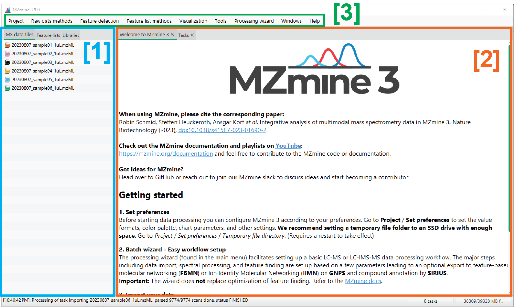

# Main window

The MZmine 3 main window consists of four tabs:

1.  **Datafiles and feature lists tab**. Here you can find the imported datafiles and
    processed feature lists. Datafiles can be imported in MZmine by drag-and-dropping them directly in the 'MS data files' subtab.

2.  **Main content panel**. [Visualization of raw data](../data_visualization/index.md) as well as [processing results](output.md) (e.g., feature lists) can be done in this panel. Multiple tabs can be opened in this panel. Moreover, tabs can also be opened in separate windows by right-click on the header and 'Open in new window'.

3.  **Menu**. Form the menu you can open/save MZmine projects, change software preferences and access alsmost any module present in MZmine. Submenus are organized as follows:

    - Project.
    - Raw data methods.
    - Feature detection.
    - Feature lists methods.
    - Visualization.
    - Tools.
    - Processing wizard.
    - Windows.
    - Help.
    - **[TODO: add descriptions]**

    [//]: # "TODO after Menu cleanup"

---

## Task overview

The Task overview displays the status/progress of all running tasks. Tasks can be canceled by right click and 'Cancel task'. The task overview can be arranged as a tab in the main content panel, a separate panel in the main window, or simply hidden. To do so, go to '**Windows → Task manager**'.

## Page Contributors

{{ git_page_authors }}
