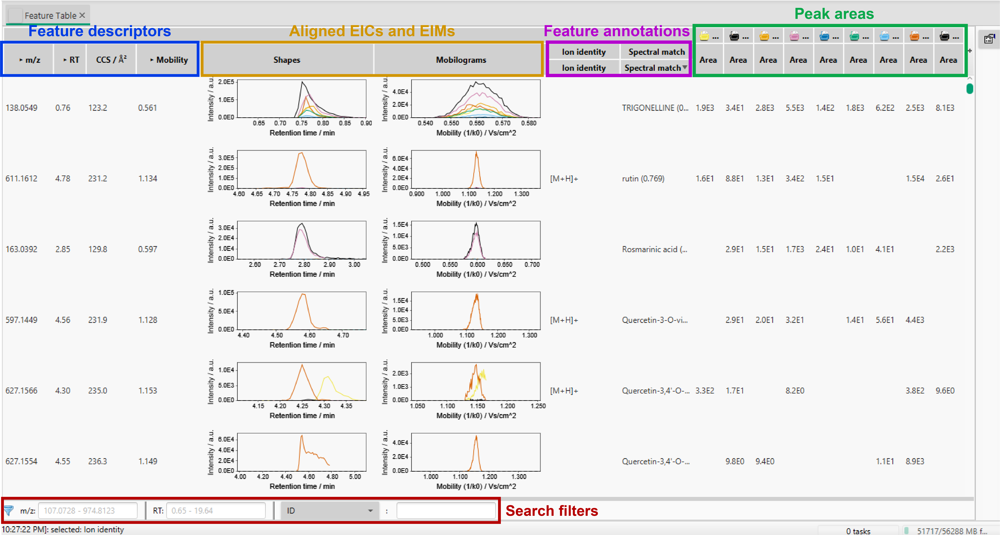

# Output

The main outputs generated during feature detection and annotation in MZmine are:

- **Aligned feature tables (CSV format)**. They contain information about the abundance of each feature across the different samples, as well as other chemical annotations (e.g. isotopic pattern, adduct type, spectral library match).
- **MS2 spectral lists (MGF format)**. They represent a summary of the fragmentation spectra associated with each feature.

Both these outputs are used by other third-party tools for further downstream analysis (see [Integration to other tools](../workflows/tool_integration.md)).

## Explore _feature lists_

Feature lists can be visualised and explored directly in MZmine. To open a feature list in the [main window](main_window_overview.md) simply double click on it (or 'right click → Open feature list')

The displayed columns can be changed by clicking the button in the top-right corner, The search filters can be used to control the displayed features.

## Export _feature lists_

Feature lists can be exported in several formats, to facilitate the [integration with downstream tools](../workflows/tool_integration.md). To do so, go to 'Feature list methods → Export feature lists' and select one of the available options. In particular:

- CSV. **Add description**
- CSV (legacy MZmine 2). **Add description**
- Molecular networking files. **Add description**
- Export spectral network to graphml (FBMN/IIMN). **Add description**
- SIRIUS / CSI-FingerID. **Add description**
- Statistics export (MetaboAnalyst) **Add description**
- Export compound annotations to CSV. **Add description**
