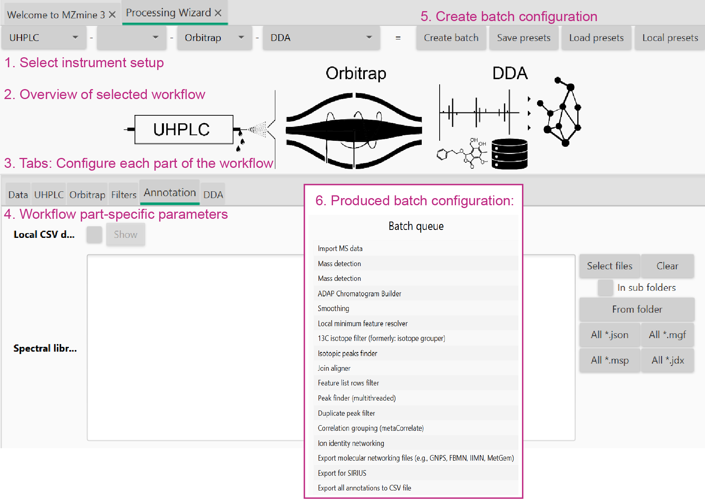

# Processing wizard

The _Processing wizard_ enables the quick and beginner-friendly generation of standardized [batch workflows](batch_processing.md#batch-file) for the different MS platforms (e.g., LC–MS, GC–MS). The configuration of complex workflows is reduced to a few parameters, from which all other feature detection settings are estimated/calculated.

To _Processing wizard_ can be opened from the corresponding MZmine menu or by pressing ++ctrl+w++ (++command+w++ on Mac). This will open the following dialog:

The wizard is organised in the following sections:

- Sample introduction. Select the instrumental setup and/or ionization source (e.g. HPLC, MALDI, flow-injection)
- IMS. If ion-mobility separation was eanbled during the analysis, select the IMS device (e.g., TIMS, DTIMS), otherwise leave the field empty.
- MS analyser. Select the MS analyser used for the analysis.
- Data acquisition. Select the data acquiistion strategy used for the analysis (e.g. DDA, DIA).

After selecting the desired instrumental setup, each section can be configured in the tabs shown in the bottom panel.

Directories for input data import and output files export can also be specified. Although default parameters are provided, adjustments might be needed based on the specific user’s application or instrument performance. After setting all the required parameters, click the ‘Create batch’ button to open the created batch file in the [batch window](batch_processing.md#batch-mode-gui).

Parameters here reflect the sensitivity, resolution, and accuracy of these parts of the hyphenation.

!!! warning

    The default settings are optimized on sample datasets used during the MZmine development. Although probably suitable for many appications, it is strongly recommended not to blindly rely on them. Rather, use them as as a reference and/or starting point for optimization.

## Data import

Specify all data files that need to be processed

## Sample introduction system

Depends on the selected sampling system, e.g., MALDI, HPLC, ...

### Chromatography-based

#### Smoothing

Apply smoothing to the chromatograms

#### Stable ionization across samples

Used during feature grouping of adducts and other ions of the same molecule. Only use if matrix (e.g., salt) contents and ionization efficiencies are comparable across the whole study.

#### Crop retention time

Crops the chromatograms at these retention time values. Useful to cut off the start and the end of the chromatograms. The start is often diverted into the waist and the end often contains the cleanup procedure.

#### Max peaks in chromatogram

An estimate of the number of isomers and isobaric ions in the chromatograms. Used to estimate the percentage of data points that hold useful data for the feature resolving step. (Chromatographic threshold in local minimum resolver).

#### Minimum consecutive scans

Only keep chromatograms and features with at least X data points in retention time dimension.

#### Approximate feature FWHM

The full-width at half maximum of peaks in retention time dimension. Best extracted from the feature tables of already processed test datasets or from the raw data overview.

#### RT tolerance (intra-sample)

Retention time tolerance to group adducts and isotopes of the same molecule. The comparison is performed within each individual sample, usaully leading to small variance.

#### RT tolerance (sample-to-sample)

Retention time tolerance to align features across all samples. Dependent on retention time shifts.

## Ion mobility instrument

#### Smoothing

Applies smoothing to the ion mobilograms

#### Minimum consecutive scans

The number of consecutive scans/datapoints in a valid ion mobilogram and feature

#### Approximate feature FWHM

The full-width at half maximum for IMS features

## MS instrument, e.g., Orbitrap, qTOF, FTICR

#### Noise threshold (MS1/MS2)

Choose the mass detector from the drop down menu. Choose the **Factor of lowest signal** for centroided data where each spectrum contains noise signals, often represented by many signals at the same low intensity (spectral grass). This may correspond to static noise or single counts. Otherwise use an **absolute intensity** threshold.

Depending on the selected mass detector, separate absolute noise levels or factors are defined to threshold spectra of MS level 1 and 2 (or above). So the MS2 noise level is used for MSn data with level > 1. These parameters can be optimized by looking at the spectral raw data in the raw data overview.

#### Minimum feature height

The minimum height of chromatograms and features

#### Scan-to-scan m/z tolerance

Relative and absolute m/z tolerance. Always applies the maximum tolerance based on the m/z this means that smaller and higher values are stronger affected by the absolute and relative tolerance, respectively.
Used to find the same signal in different scans when connecting chromatigrams. Reflects on the mass accuracy between scans in the same raw data file.

#### Feature-to-feature m/z tolerance

Relative and absolute m/z tolerance. Always applies the maximum tolerance based on the m/z this means that smaller and higher values are stronger affected by the absolute and relative tolerance, respectively.
Used to group isotopes and adducts of the same molecule. Those m/z values are already averaged over their features and should have lower m/z differences that the scan to scan tolerance.

#### Sample-to-sample m/z tolerance

Relative and absolute m/z tolerance. Always applies the maximum tolerance based on the m/z this means that smaller and higher values are stronger affected by the absolute and relative tolerance, respectively.
Used to align features across samples. Those m/z values are already averaged over their features but originate from differnt samples.

## Filters

#### Original feature list

Options to either _keep_ or _remove_ the original feature lists. _Keep_ is valuable during workflow optimization whereas _remove_ saves resources and allows for more performant processing or large datasets. (See section on performance).

#### Min samples per aligned feature

Only keep aligned features that were detected in at least n samples. This parameter should usually scale with the sampleset size and if samples are relatively similar from their compounds. Uses the maximum of an absolute and relative value.

#### Only keep features with 13C

Detect isotope pattern and only keep feature with valid 13C isotope pattern.

## Annotation

#### Spectral library files

Select all spectral libraries to import and use during spectral library matching to annotate compounds in the final aligned feature list.

#### Local CSV database

- Specify the database file (csv or tsv format).
- Select m/z option to either
  - calculate from given neutral mass (or formula/structure)
  - use provided precursor m/z in column
- Filename column is only used for the library generation workflow
- Columns map the table column headers to the internal names in MZmine

## Workflows

Most of the parameters in the workflow section define data output and some workflow specific parameters.

### General parameters

- Define an export path and base file name, e.g., _"D:\analysis\date_project"_ this will create a new folder and save all files from export modules there. Each module will add a specific suffix to the file name.
- Apply spectral networking (FBMN/IIMN): Will compare all MS2 spectra across features to form molecular networks by spectral similarity.
- Export for molecular networking (e.g., GNPS, FBMN, IIMN, MetGem): Will export all files for molecular networking
- Export for SIRIUS: Will export all files needed for SIRIUS
- Export annotation graphics: Exports annotations like spectral library matches, lipid matches, etc to graphical reports. Contains options to also export chromatographic/ion mobility shapes, images, and other plots.

### Workflow parameters and descriptions

#### DDA

The data-dependent acquisition workflow is the default non target workflow. We recommend to also use this workflow for targeted analysis and combine it with the local CSV database search and spectral library search (_Annotation_).

#### Library generation

More method and contributor **metadata** is required to build spectral libraries. This workflow produces reference libraries with options to filter and merge spectra.

{{ git_page_authors }}
