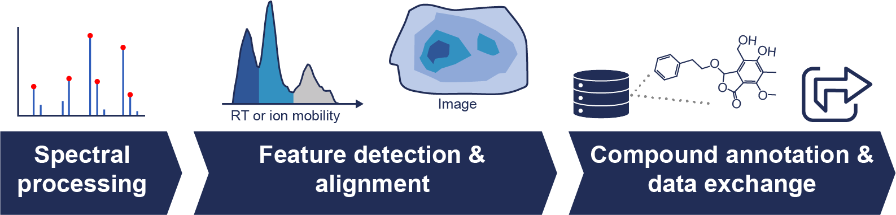
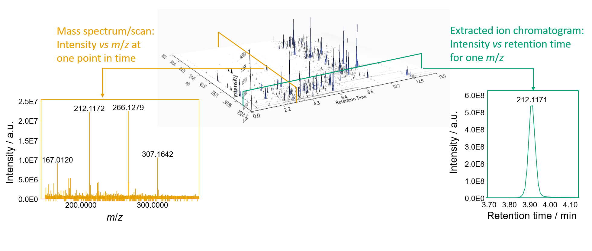
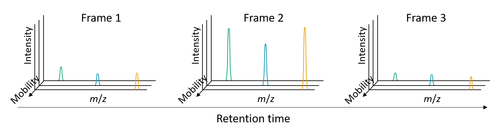

# Feature detection in MZmine 3

The overall goal of MS data processing is to turn raw spectral data into a list of detected ions (conventionally called [_features_](#what-is-a-feature)), to estimate their abundance, and to assign chemical annotations based on multiple criteria. In MZmine, this is done in a three-step approach:

1. Spectral processing. Raw spectral data are centroided and intensity thresholds can be applied to exclude low-intensity signals (e.g. electronic noise) from further processing.
2. Feature detection (a.k.a. ‘feature finding’ or ‘peak picking’). The goal of feature detection is to retain all relevant features in the data while discarding ‘noisy’ signals. Moreover, features detected in different samples can be aligned to enable consistent sample-to-sample comparison (e.g. statistical analysis).
3. Feature annotation. Various chemical annotations can be assigned to each feature based on additional information retrieved from raw spectral data (e.g. isotope pattern, MS2 spectra), using dedicated modules (e.g. lipid annotation15), or via leveraging the direct integration of MZmine with other popular annotation tools (e.g. [SIRIUS](https://bio.informatik.uni-jena.de/software/sirius/), [GNPS](https://gnps.ucsd.edu/ProteoSAFe/static/gnps-splash.jsp)).

# What is a feature?

A feature can be seen as a _m/z_ signal (more often a group of signals) related to a single metabolite detected in the MS analysis. Based on the instrument setup (e.g., chromatography–MS vs MS imaging), a feature can be characterised by additional identifiers such as retention time (RT) or spatial coordinates Untargeted MS experiments typically yield hundreds to thousands of features, although a relatively small portion corresponds to meaningful metabolites in the sample. For this reason, the goal of feature detection is to retain all relevant features in the raw spectral data while discarding ‘noisy’ signals.

## LC-MS vs LC-IMS-MS data

LC-MS data consists of three dimensions: _m/z_, _RT_, _intensity_. At every retention time, a whole mass spectrum is acquired (yellow).
Putting all scans together creates a three-dimensional plane. By slicing the three-dimensional data at a single m/z value (+- a value of tolerance),
**EICs** (green).

**Ion mobility resolved data**, on the other hand, consists of a three-dimensional data plane at each
retention time.
The three dimensions being:

- m/z,
- intensity,
- and mobility (as drift time (ms) or
  inverse reduced mobility $1/K_0 [Vs/(cm^2)]$).

The 3D projection of regular LC-MS data can be created
by summing all mobility scans of a frame to create a frame spectrum.
(see [Mobility scan merging](../module_docs/featdet_mobility_scan_merging/mobility-scan-merging.md))

{{ git_page_authors }}
