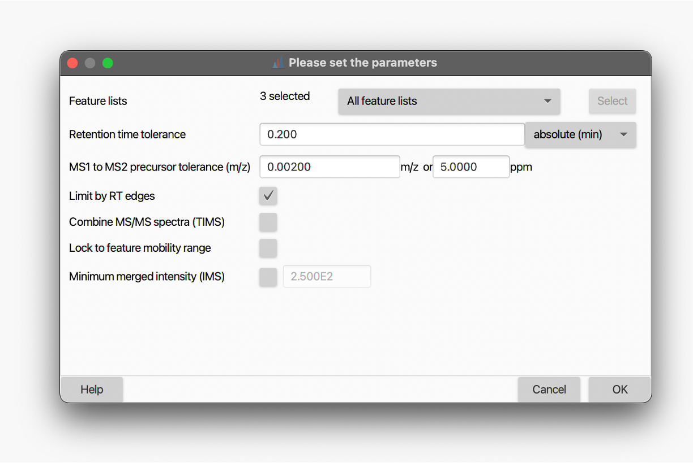

# MS/MS scan pairing
:material-menu-open: **Feature list methods → Processing → Assign MS2 to features**

This module pairs the MS2 fragmentation spectra (collected in [_DDA mode_](../../terminology/general-terminology.md#data-dependent-acqusition-mode-dda)) to the corresponding features. By doing so, annotations of features based on their fragmentation MS2 spectra can be associated with the individual LC peak. The algorithm examines XXX in the EIC trace. A RT tolerance is set and used to assign XXX.

This module allows to pair MS2 scans with features. It assigns all MS2 scans within range to all features in chosen feature list. 

!!! warning inline

    This module has to be run on already-resolved feature listes - i.e., a chromatogram resolving module has to be run first. Note: For IM data, run after the IM resolving too. 

---
## Parameters

#### Feature lists
Description

#### Retention time tolerance
Set thea ‘Retention time T tolerance’ for to searching  for MS2 spectra for a feature. This parameter represents the maximum offset between the chromatographic peak apex and the RT the MS2 was acquired. PROVIDE RECOMMENDATION. The maximum offset between the highest point of the chromatographic peak and the time the MS2 was acquired.

#### MS1 to MS2 precursor tolerance (m/z)
Describes the tolerance between the precursor ion in a MS1 scan and the precursor m/z assigned to the MS2 scan. Set a m/z tolerance between the feature’s m/z and the stored precursor m/z in the raw data. We recommend 0.01 m/z and 10 ppm for Orbitrap and TOF instruments.

#### Limit by RT edges
Use the feature's edges (retention time) as a filter. Select ‘Limit by RT edges’ to only search for MS2 spectra within the start and end time of a feature (=chromatographic peak).

#### Combine MS/MS spectra (TIMS)
If checked, all MS/MS spectra assigned to a feature will be merged into a single spectrum.

!!! warning inline

    This is usually not needed. However, if isomers/isobars elute at the same retention time and are close in mobility, the MS/MS window might be larger than the peak in mobility dimension and thus cause chimeric MS/MS spectra.

#### Lock to feature mobility range
Description

#### Minimum merged intensity (IMS)
If an ion mobility spectrometry (IMS) feature is processed, this parameter can be used to filter low abundant peaks in the MS/MS spectrum, since multiple MS/MS mobility scans need to be merged together.

---
{{ git_page_authors }}

