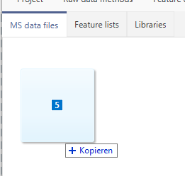
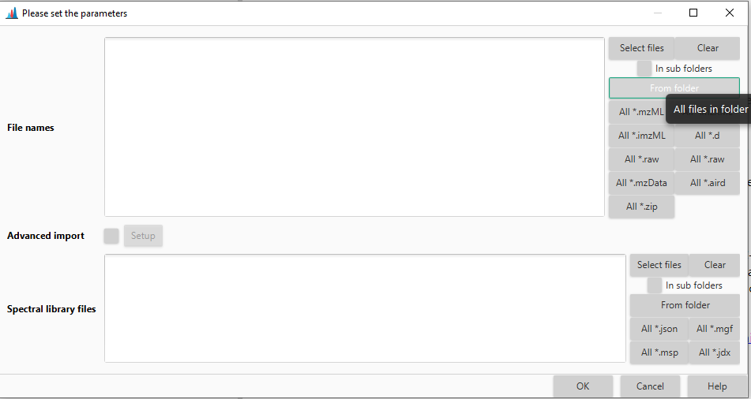

# **Data import**

You can simply drag & drop the raw data into the raw data list of the main window. Alternatively,
more options are listed below.

## **LC-MS data**

### **Description**

Raw data can be imported via :material-menu-open: **Raw data methods → Raw data import**. Select the data format and browse
the files to import.

With another option, multiple data files/folders can be selected with the :material-menu-open: **Raw data methods → Raw data import → MS data (advanced)** dialog. 
In the dialog box, click **From folder** or choose the preferred data format (All*.) and browse the desired directory. All data files stored therein will be imported.
The enabled option **in sub folders** searches all files in the whole subdirectory tree.

If individual modules are used, folder based formats can only be imported as one folder at a time. 

:material-lightbulb: When processing very large datasets, e.g., hundreds to thousands of data files, the mass detection
can be run during the import. All signals below the specified noise level are not imported (altering the raw data on the import) thus saving memory and processing time.
Therefore, use the **Raw data methods → Raw data import → MS data (advanced)** dialog, and tick the **Advanced import** checkbox
and set the mass detection parameters as described in the Mass detection section. The noise level needs to be known
in advance.

 

[//]: # (TODO Add images not in German)

## **LC-IMS-MS data**

As any other data format, ion mobility data can be imported via :material-menu-open:**Raw data methods →
Raw data import**. 

Note that multiple .tdf data folders can be dropped into the
**MS data (advanced)** dialog. The Bruker TDF import can only select a single folder. 

:material-lightbulb: When using the **MS data (advanced)** dialog, inexperienced users should deactivate the direct mass detection steps, since they alter the raw data on the import. Mass detection is then performend, when the
scans are loaded and only peaks above the noise level are imported.

Alternatively, you can simply drag & drop the raw data into the raw data list of the main window.

{{ git_page_authors }}
