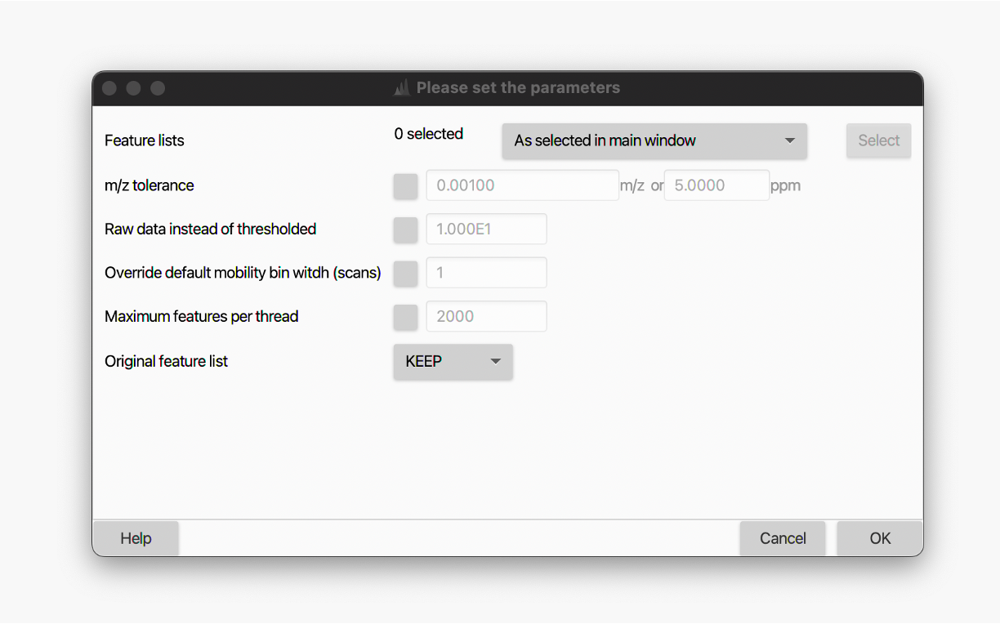

# IMS Expander
:material-menu-open: **Feature detection → LC-IMS-MS → Ims expander**

When processing LC-IMS-MS data, MZmine first treat them as regular LC-MS dagta, the it expand the features in the IMS dimension using the present module. In fact, only the accumulated frame spectra are taken in account in the first place.  This means that features are still only described by a m/z value and a RT range. No information from the IMS dimension is used. The IMS expander searches for data points in mobility scans for existing features. To do so, individual mobility scans are examined (within this m/z and RT range) to build and resolve EIMs (similarly to what is done in the RT dimension). The underlying mobility resolved spectra are searched to describe the feature using the signals from the mobility resolved scans.

!!! warning inline

    Since m/z and RT range may contain multiple features/compounds. Therefore, EIMs must also be resolved by a feature resolver after their detection.  In case of jagged EIMs, they can be smoothed prior to resolving.
    
    This requires prior chromatogram building (see [ADAP Chromatogram builder](../../lc-ms_featdet/featdet_adap_chromatogram_builder/adap-chromatogram-builder.md) and resolving in retention time dimension (see [Resolving](../../featdet_resolver_local_minimum/local-minimum-resolver.md)).

---

## Parameters

#### Feature lists

Select the feature list(s) to process.

#### m/z tolerance

Maximum allowed _m/z_ deviation between frame and mobility scans. When enabled, the specified tolerance is used to search for data points in the IMS dimension; otherwise, the feature's m/z distribution across the

**Recommended setting: selected, 0.003 m/z and 15 ppm**

#### Raw data instead of thresholded

When enabled, 

Enables searching in mobility scan raw data instead of the thresholded (i.e., mass detected) data. Only
possible for centroid raw data files.

#### Override default mobility bin width (scans)

If selected, the default number of binned mobility scans can be overriden. Useful for data with high
mobility resolution. 

#### Maximum features per thread 

Description

#### Original feature list 

Description.

### Binned mobilogram example

{{ git_page_authors }}