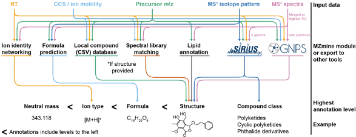

# Integration to other tools

MZmine offers various modules to assign chemical annotations (e.g., ion adducts, molecular formula) to the detected features. Furthermore, harmonised data formats and dedicated export modules in MZmine enable its other popular annotation tools. An overview of the most popular feature annotation modules and integrated third-party tools is provided in the [figure](#integration-to-other-tools). The full list of feature annotation tools integrated in MZmine is provided in the table below.

| **Tool**                                                                                                                          | **Doc**                                                                                                                                                                | **MZmine module**                                                                                                                                           | **Data format**                    | **Description**                                                                                                                                                  |
| --------------------------------------------------------------------------------------------------------------------------------- | ---------------------------------------------------------------------------------------------------------------------------------------------------------------------- | ----------------------------------------------------------------------------------------------------------------------------------------------------------- | ---------------------------------- | ---------------------------------------------------------------------------------------------------------------------------------------------------------------- |
| [SIRIUS](https://bio.informatik.uni-jena.de/software/sirius/)                                                                     | [Doc](https://ccms-ucsd.github.io/GNPSDocumentation/sirius/#with-the-feature-based-molecular-networking)                                                               | Export to SIRIUS                                                                                                                                            | .MGF                               | Contains MS2 spectra and MS1 or correlated MS1 spectra for each feature list row                                                                                 |
| [GNPS-FBMN](https://www.nature.com/articles/s41592-020-0933-6) [GNPS-IIMN](https://www.nature.com/articles/s41467-021-23953-9) | [FBMN](https://ccms-ucsd.github.io/GNPSDocumentation/featurebasedmolecularnetworking-with-mzmine2/) [IIMN](https://ccms-ucsd.github.io/GNPSDocumentation/fbmn-iin/) | [Export/submit GNPS-FBMN](../module_docs/io/data-exchange-with-other-software.md#gnps-fbmniimn-export)                                                      | .mgf \_quant.csv \_edges.csv | - Contains one representative MS2 spectrum per feature - The feature list as an intensity (area/height) matrix - The additional IIN edges between features |
| [GNPS-GC-MS](https://ccms-ucsd.github.io/GNPSDocumentation/gcanalysis/)                                                           | [Doc](https://ccms-ucsd.github.io/GNPSDocumentation/gc-ms-deconvolution/#gc-ms-data-processing-with-adap-mzmine)                                                       | [Export to GNPS-GC-MS](../module_docs/io/data-exchange-with-other-software.md#gnps-gc-ms-with-adap)                                                         | .mgf \_quant.csv                | - Contains one representative correlated GC-MS1 spectrum per feature - The feature list as an intensity (area/height) matrix                                  |
| [MetaboAnalyst](https://www.metaboanalyst.ca/)                                                                                    | [Doc](https://www.metaboanalyst.ca/docs/Format.xhtml#ac:j_idt38)                                                                                                       | [Export to MetaboAnalyst](../module_docs/io/data-exchange-with-other-software.md#metaboanalyst-export)                                                      | .csv                               | Metadata grouped feature intensity matrix (area/height)                                                                                                          |
| R, Python                                                                                                                         |                                                                                                                                                                        | [Export to CSV (legacy)](../module_docs/io/feat-list-export.md#csv-legacy-mzmine-2) [Export to CSV (modular)](../module_docs/io/feat-list-export.md#csv) | .csv                               | Export any row (averaged) and feature (per sample) types to a tabular format. Export all columns from the feature table to a tabular format.                  |
| [tidyMass](https://github.com/tidymass/tidymass)                                                                                  | [Doc](https://www.tidymass.org/docs/chapter2/3-mass_dataset_other_tools/#mzmine-feature-table-to-mass_dataset-class)                                                   | [Export to CSV (legacy)](../module_docs/io/feat-list-export.md#csv-legacy-mzmine-2)                                                                         | .csv                               | Export any row (averaged) and feature (per sample) types to a tabular format                                                                                     |
| [MetDNA](http://metdna.zhulab.cn/)                                                                                                | [Doc](https://github.com/ZhuMetLab/MetDNA2_Web/blob/main/Tutorials/Tutorial_data_preprocessing_MZmine.pdf)                                                             | [GNPS-FBMN/IIMN export](../module_docs/io/data-exchange-with-other-software.md#gnps-fbmniimn-export)                                                        | .csv                               | Export any row (averaged) and feature (per sample) types to a tabular format                                                                                     |
| [NeatMS](https://github.com/bihealth/NeatMS)                                                                                      | [Doc](https://neatms.readthedocs.io/en/latest/first-steps/data-format/)                                                                                                | [Export to CSV (legacy)](../module_docs/io/feat-list-export.md#csv-legacy-mzmine-2)                                                                         | .csv                               | Export any row (averaged) and feature (per sample) types to a tabular format                                                                                     |
| [NetID](https://www.nature.com/articles/s41592-021-01303-3)                                                                       | [Doc](https://github.com/LiChenPU/NetID)                                                                                                                               | [Export to CSV (legacy)](../module_docs/io/feat-list-export.md#csv-legacy-mzmine-2)                                                                         | .csv                               | Export any row (averaged) and feature (per sample) types to a tabular format                                                                                     |
| [mzRAPP](https://github.com/YasinEl/mzRAPP#exporting-npp-outputs-from-different-tools)                                            | [Doc](https://github.com/YasinEl/mzRAPP#exporting-npp-outputs-from-different-tools)                                                                                    | [Export to CSV (legacy)](../module_docs/io/feat-list-export.md#csv-legacy-mzmine-2)                                                                         | .csv                               | Export any row (averaged) and feature (per sample) types to a tabular format                                                                                     |
| [MetGem](https://metgem.github.io/)                                                                                               | [Doc](https://metgem.readthedocs.io/en/latest/user_manual/import.html#id1)                                                                                             | [MSP Export](../module_docs/io/feat-list-export.md#msp-export) [MGF Export](../module_docs/io/feat-list-export.md#mgf-export)                           | .msp .mgf                      |                                                                                                                                                                  |
| [TIMA](https://github.com/taxonomicallyinformedannotation/tima-r)                                                                 | [Doc](https://taxonomicallyinformedannotation.github.io/tima-r/index.html)                                                                                             | Export/submit GNPS-FBMN                                                                                                                                     | \_quant.csv \_edges.csv         | - The feature list as an intensity (area/height) matrix - The additional IIN edges between features                                                           |
| [_Inventa_](https://github.com/luigiquiros/inventa)                                                                               | [Doc](https://luigiquiros.github.io/inventa/)                                                                                                                          | Export/submit GNPS-FBMN / Export to Sirius                                                                                                                  | .mgf \_quant.csv \_edges.csv | - Contains one representative MS2 spectrum per feature - The feature list as an intensity (area/height) matrix - The additional IIN edges between features |
| [MEMO](https://github.com/mandelbrot-project/memo)                                                                                | [Doc](https://memo-docs.readthedocs.io/en/latest/index.html)                                                                                                           | Export/submit GNPS-FBMN                                                                                                                                     | .mgf                               | - Contains one representative MS2 spectrum per feature                                                                                                           |
| [SLAW](https://github.com/zamboni-lab/SLAW)                                                                                       | [Doc](https://github.com/zamboni-lab/SLAW)                                                                                                                             | Export/submit GNPS-FBMN                                                                                                                                     | .mgf \_quant.csv \_edges.csv | - Contains one representative MS2 spectrum per feature - The feature list as an intensity (area/height) matrix - The additional IIN edges between features |
| [FERMO](https://github.com/mmzdouc/FERMO/)                                                                                        | [Doc](https://github.com/mmzdouc/FERMO/wiki/)                                                                                                                          | [Export/submit GNPS-FBMN](../module_docs/io/data-exchange-with-other-software.md#gnps-fbmniimn-export)                                                      | .mgf \_quant.csv                | - Contains one representative MS2 spectrum per feature - The feature list as an intensity (area/height) matrix                                                |

## Page Contributors

{{ git_page_authors }}
